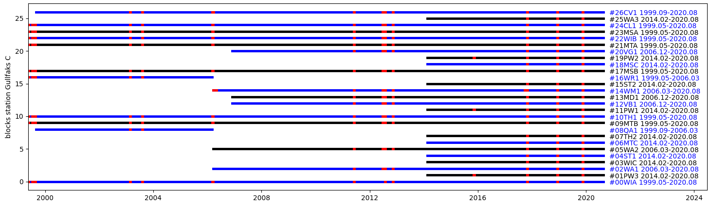
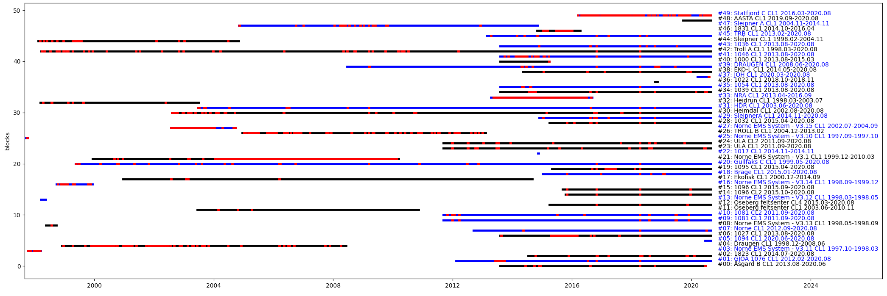
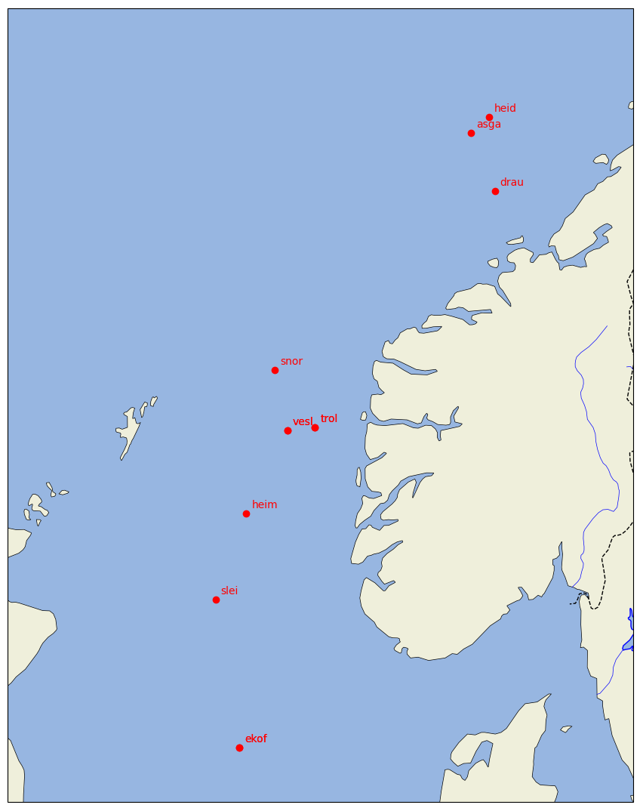

# d22_data_format

A repo for gathering information / datasheets / scripts about the d22 data format.

## Installation

This code is python 3.7 or higher. The code was developed on Ubuntu 20.04 but should work on other Linux distributions.

To install, add to your pythonpath. For example on my machine I add on my ```.bashrc```:

``` export PYTHONPATH="${PYTHONPATH}:/home/jrmet/Desktop/Git/d22_data_format``` .

Needed packages:

- matplotlib
- netCDF4

## Description

The code in this module implements a parser for the d22 data format, as well as data block classes to translate the data in each data block. Some tools are also provided to create overviews of the data available, and create datasets on common time bases.

The module is contained in ```d22_data_format```. The module has tests that can be run through: ```pytest -v .``` from the root of the repo (i.e., the present location).

## How to use

- d22 format parser: the parsing itself is performed by the ```D22Parser``` class in ```d22_data_format.d22_parser.py``` . One obtains data as a dict out of it, where the keys are 1) the station 2) the time 3) the data block.

- interpretation of the data blocks is performed by the ```process_dict_blocks``` function in ```d22_data_format.data_block_interpreters.py``` . Each data bloc specification should have a corresponding interpreter there, as well as entry in the ```dict_block_processers``` dict. Some block may be not implemented at the moment depending on my needs. Additional blocks may be implemented following the datasheets in the ```d22_documentation``` folder. Feel free to open an issue if necessary.

- exploration of the data available can be performed using the tools available in the ```datablocks_summary.py``` folder. For example, one can show all data available from a station, or all datablocks of a given kind available from all stations. Red indicates dropout. See the script ```script_generate_datablocks_summary.py``` for more details, if necessary open an issue. Once the dict pure metadata has been generated, one can perform:

    - exploring all data blocks available for 1 station (red indicates dropout) ```show_summary_blocks_one_station(dict_pure_metadata, "Gullfaks C")```:

        

    - exploring all data blocks of a given type across all stations (red indicates dropout) ```show_summary_blocks_across_stations(dict_pure_metadata, list_block_prefixes=["CL"])```:

        

- name lookup between the station folders and the data package header names: this can be performed using ```name_lookups.py``` and looking at the dict / log of scripts there. The challenges are: 1) the root data folders have names that are quite good and explicit, but 2) in the data packages, station IDs are used that do not fit these folder names. In addition, the package IDs do not seem to be fully constant in time neither consistent with the data root folder name... (see examples in Notes / Scratchbook).

- some plotting tools for the position of (some of) the stations are also available, see ```script_plot_positions_on_map.py```. The data used for plotting is extracted from the dict ```dict_name_to_position``` in ```name_lookups.py```. Feel free to extend the corresponding dict through pull requests.

    

- Datasets can be assembled using the ```DataExtractor``` class in ```data_extractor.py```. Each entry in the dataset needs to be asked through the definition of a specification following the ```DataSpec``` class format defined in the same file. For example, a valid spec is ```DataSpec("aastahansteen", "AASTA", "MD1", "magnetic_declination")```, which will look in the ```aastahansteen``` data folder, look for data packages with station name ```AASTA```, and use data from datablock ```MD1```, entry ```magnetic_declination```. For a small example with d22 magnetic declination data, run ```data_extractor_test.py```. For a full example against the full lustre data, see the ```script_dataset_generation.py``` (some of the steps there may take a long time). This will allow to create datasets on common time bases, and simple plots, for example in the case of the magnetic declination data:

    

## WL data

A specific example of dataset generation is in the ```WL_data``` folder. There is quite a lot of work to do by hand to use the right / best sensor from each platform, copy paste the different signals, take away the bad data, etc.
